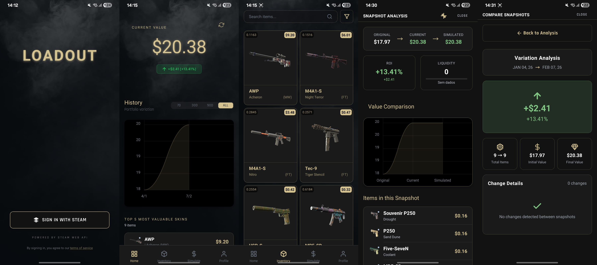

<div align="center">




# Loadout

**Steam item portfolio — React Native**

Track CS2 skins, inventory, and snapshot simulations. Sign in with Steam, manage your profile, and run portfolio analytics from your phone.

[](https://reactnative.dev/)
[](https://nodejs.org/)
[](https://www.typescriptlang.org/)
[](.)

</div>

---

## Table of contents

| Section | Description |
| :--- | :--- |
| [Features](#features) | What the app does |
| [Tech stack](#tech-stack) | Libraries and tools |
| [Requirements](#requirements) | Prerequisites |
| [Quick start](#quick-start) | Clone, install, run |
| [Running the app](#running-the-app) | Metro and device/emulator |
| [Scripts](#scripts) | Available npm and shell commands |
| [Release build](#release-build-apk) | Standalone APK for testers |
| [Reload vs rebuild](#reload-vs-rebuild) | When to reload vs full rebuild |
| [Troubleshooting](#troubleshooting) | Common issues and fixes |
| [Additional notes](#additional-notes) | Fonts, DevTools, deep links |

---

## Features

- **Steam sign-in** — OAuth flow with deep link callback (`loadout://auth-callback`)
- **Dashboard** — Overview of your Steam item portfolio
- **Inventory** — Browse and manage CS2 skins and items
- **Snapshot simulations** — Run and compare portfolio scenarios
- **Profile management** — Update settings and preferences

**Backend:** `https://skinfolio-backend-v2.onrender.com`

---

## Tech stack

| Category | Choice |
| :--- | :--- |
| Framework | React Native 0.82 |
| Language | TypeScript |
| UI / state | React 19, React Navigation, TanStack Query |
| Native modules | Fast Image, WebView, Video, SVG, Gesture Handler, Safe Area, In-App Browser |

---

## Requirements

| Platform | Requirement |
| :--- | :--- |
| **Node** | 20+ |
| **Android** | Android Studio, device or emulator |
| **iOS** | Xcode, CocoaPods, device or simulator |

---

## Quick start

```bash
git clone https://github.com/sidnei-almeida/loadout-portfolio.git
cd loadout-portfolio
npm install --legacy-peer-deps
npm start
```

In a second terminal:

```bash
npm run android   # or: npm run ios
```

> The project uses React 19; some dependencies declare older peer ranges, so `--legacy-peer-deps` is required. A `.npmrc` file is already configured.

---

## Running the app

1. **Start Metro** (required; keep it running):
   ```bash
   npm start
   ```

2. **Run on device or emulator:**
   ```bash
   npm run android
   # or
   npm run ios
   ```

**iOS** — First time or after changing native dependencies:

```bash
bundle install
bundle exec pod install
```

**Android Studio:** Open the `android/` folder (not the repo root), wait for Gradle sync, then run the app with Metro already running.

---

## Scripts

| Command | Description |
| :--- | :--- |
| `npm start` | Start Metro bundler |
| `npm run android` | Run on Android device/emulator |
| `npm run ios` | Run on iOS device/simulator |
| `npm run lint` | Run ESLint |
| `npm test` | Run Jest tests |
| `./build-apk.sh` | Build **release** APK (standalone) |
| `./build-apk.sh debug` | Build debug APK |
| `./prepare-android.sh` | Prepare Android project for Android Studio |
| `./run-android-dev.sh` | Check device, `adb reverse`, start Metro |

---

## Release build (APK)

Standalone APK for testers (no Metro required):

```bash
./build-apk.sh
# or explicitly
./build-apk.sh release
```

**Output:** `android/app/build/outputs/apk/release/app-release.apk`

Release builds are signed with the debug keystore (suitable for internal/testing). For Play Store distribution, configure a release keystore in `android/gradle.properties` and `android/app/build.gradle`.

---

## Reload vs rebuild

| Change | Action |
| :--- | :--- |
| JS, TS, or styles only | Reload in app: press `r` in Metro terminal or shake device → Reload |
| `metro.config.js` or `babel.config.js` | Stop Metro, then `npm start -- --reset-cache` |
| `android/` or `package.json` (dependencies) | `npm install`, then `cd android && ./gradlew clean`, then `npm run android` |

---

## Troubleshooting

<details>
<summary><strong>“Unable to load script” / “No connected targets”</strong></summary>

Start Metro before launching the app: run `npm start`, then `npm run android` (or Run from Android Studio).
</details>

<details>
<summary><strong>Physical device not loading bundle</strong></summary>

```bash
adb reverse tcp:8081 tcp:8081
```
</details>

<details>
<summary><strong>Metro cache issues</strong></summary>

```bash
npm start -- --reset-cache
```
</details>

<details>
<summary><strong>Android build failure</strong></summary>

```bash
cd android && ./gradlew clean && cd ..
```
Then run the build again.
</details>

<details>
<summary><strong>Gradle download timeout</strong></summary>

In `android/gradle/wrapper/gradle-wrapper.properties`, increase `networkTimeout` (default 120000 ms) if your connection is slow.
</details>

<details>
<summary><strong>CMake “non-existent path” / ReactAndroid::jsi</strong></summary>

Run a full clean: `./build-apk.sh release --clean`. If the error persists, clear the Gradle transform cache:

```bash
rm -rf ~/.gradle/caches/transforms-3*
```

Then run the build again.
</details>

---

## Additional notes

- **Fonts:** Orbitron, Rajdhani, and JetBrains Mono live in `assets/fonts/`. For Android, copy them to `android/app/src/main/assets/fonts/` if needed.
- **DevTools on Linux:** `CHROME_PATH=/usr/bin/brave npm start` or `npm run start:devtools` (if configured).
- **Deep link:** Steam auth callback uses `loadout://auth-callback`.

---

<div align="center">

**[Repository](https://github.com/sidnei-almeida/loadout-portfolio)** · Documentation consolidated from project history

</div>
