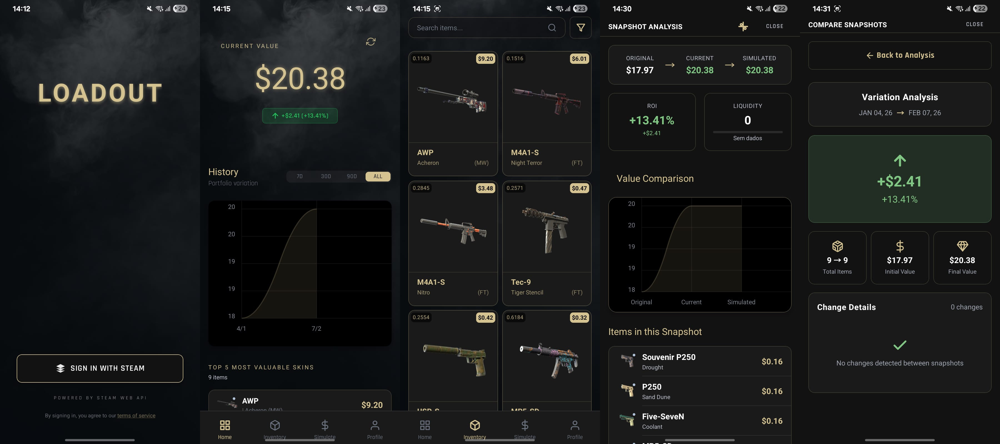

<div align="center">


**Steam item portfolio — React Native**

Track CS2 skins, inventory, and snapshot simulations. Sign in with Steam, manage your profile, and run portfolio analytics — **all from your phone, no cloud required**.

[](https://reactnative.dev/)
[](https://nodejs.org/)
[](https://www.typescriptlang.org/)
[](.)



</div>

---

## 🌍 Local-First: Your Data, Your Device

**Loadout Portfolio** used to depend on cloud APIs and remote databases. **That's history.**

The app is now **100% Local-First**. All your data — inventory, price history, portfolio snapshots, and preferences — lives **exclusively on your phone**. Nothing is stored in the cloud. No accounts on our servers. No telemetry, no analytics, no data collection.

### Why this matters

| Before (cloud) | Now (local-first) |
|:---|:---|
| Your data on our servers | Your data **only** on your device |
| Dependency on cloud uptime | Works offline after initial sync |
| Privacy concerns with third-party storage | **You** control your data |
| Risk of data breach on our infrastructure | No server = nothing to breach |
| Uninstall = "maybe deleted" | Uninstall = **permanent deletion** |

All Steam API requests go **directly** from your device to Valve. We don't proxy, relay, or intercept. Your Steam credentials never touch our infrastructure — because we don't have any.

---

## ✨ Features

- **Steam sign-in** — OAuth flow with deep link callback (`loadout://auth-callback`)
- **Dashboard** — Portfolio overview, value trends, top items
- **Inventory** — Browse CS2 skins with filters, search, multiple view modes (cards, icons, details). Supports **Storage Units** with encrypted display.
- **Snapshot simulations** — Save portfolio snapshots, compare over time, run "what-if" ROI analysis
- **Technical analysis** — RSI, volatility, and trend indicators per item
- **Profile** — Steam ID, account status, session management
- **Multi-language** — **English**, **Português (Brasil)**, and **Español** with persistent preference

#### Storage Units — Features and limitations

Loadout displays **Storage Units** from your CS2 inventory. Valve's API lets us know an item is a Storage Unit and exposes the item count inside (`storage_unit_item_count`), but **does not allow listing or inspecting the contents**.

| Valve limitation | App behavior |
|:---|:---|
| Cannot "open" or enter a Storage Unit via API | We show only the *wrapper*: custom name (if any) + total item count |
| Contents remain encrypted/hidden client-side | Fixed subtitle "ENCRYPTED VAULT" to indicate contents are not accessible |
| No per-item pricing or details | Value area shows `[ XX ITEMS ]` in Tactical Gold, no breakdown |

**Valve does not allow third-party apps to access the inside of Storage Units.** Loadout surfaces what the API provides — item count and custom display name — and makes it clear the vault is "encrypted," without attempting to estimate internal value or list individual skins.

### Tech highlights

- **SQLite** — Inventory, price history, snapshots
- **MMKV** — Session tokens, preferences, cooldown timers (fast, encrypted)
- **React Native 0.82** — TypeScript, React 19, TanStack Query

---

## 📦 Tech stack

| Category | Choice |
| :--- | :--- |
| Framework | React Native 0.82 |
| Language | TypeScript |
| UI / state | React 19, React Navigation, TanStack Query |
| Storage | SQLite (OP-SQLite), MMKV |
| Native modules | Fast Image, WebView, Video, SVG, Gesture Handler, Safe Area, In-App Browser |

---

## 📋 Requirements

| Platform | Requirement |
| :--- | :--- |
| **Node** | 20+ |
| **Android** | Android Studio, device or emulator |
| **iOS** | Xcode, CocoaPods, device or simulator |

---

## 🚀 Quick start

```bash
git clone https://github.com/sidnei-almeida/loadout-portfolio.git
cd loadout-portfolio
npm install --legacy-peer-deps
npm start
```

In a second terminal:

```bash
npm run android   # or: npm run ios
```

> React 19 is used; some dependencies declare older peer ranges. A `.npmrc` file configures `legacy-peer-deps` automatically.

---

## ▶️ Running the app

1. **Start Metro** (keep it running):
   ```bash
   npm start
   ```

2. **Run on device or emulator:**
   ```bash
   npm run android
   # or
   npm run ios
   ```

**iOS** — First run or after native dependency changes:

```bash
bundle install
bundle exec pod install
```

**Android:** Open the `android/` folder in Android Studio, wait for Gradle sync, then run the app with Metro already running.

---

## 📜 Scripts

| Command | Description |
| :--- | :--- |
| `npm start` | Start Metro bundler |
| `npm run android` | Run on Android device/emulator |
| `npm run ios` | Run on iOS device/simulator |
| `npm run lint` | Run ESLint |
| `npm test` | Run Jest tests |
| `./build-apk.sh` | Build **release** APK (standalone) |
| `./build-apk.sh debug` | Build debug APK |
| `./build-apk.sh release --clean` | Full clean + release build |
| `./prepare-android.sh` | Prepare Android project for Android Studio |
| `./run-android-dev.sh` | Check device, `adb reverse`, start Metro |

---

## 📱 Release build (APK)

Standalone APK for testers (no Metro required):

```bash
./build-apk.sh
# or
./build-apk.sh release
```

**Output:** `android/app/build/outputs/apk/release/app-release.apk`

Release builds use the debug keystore by default (suitable for internal/testing). For Play Store distribution, configure a release keystore in `android/gradle.properties` and `android/app/build.gradle`.

---

## 🔄 Reload vs rebuild

| Change | Action |
| :--- | :--- |
| JS, TS, or styles only | Reload in app: `r` in Metro terminal or shake device → Reload |
| `metro.config.js` or `babel.config.js` | Stop Metro, then `npm start -- --reset-cache` |
| `android/` or `package.json` (dependencies) | `npm install`, then `cd android && ./gradlew clean`, then `npm run android` |

---

## 🛠️ Troubleshooting

<details>
<summary><strong>"Unable to load script" / "No connected targets"</strong></summary>

Start Metro before launching the app: `npm start`, then `npm run android`.
</details>

<details>
<summary><strong>Physical device not loading bundle</strong></summary>

```bash
adb reverse tcp:8081 tcp:8081
```
</details>

<details>
<summary><strong>Metro cache issues</strong></summary>

```bash
npm start -- --reset-cache
```
</details>

<details>
<summary><strong>Android build failure</strong></summary>

```bash
cd android && ./gradlew clean && cd ..
```
Then run the build again.
</details>

<details>
<summary><strong>Gradle download timeout</strong></summary>

In `android/gradle/wrapper/gradle-wrapper.properties`, increase `networkTimeout` if your connection is slow.
</details>

<details>
<summary><strong>CMake "non-existent path" / ReactAndroid::jsi</strong></summary>

Full clean:
```bash
./build-apk.sh release --clean
```

If it persists, clear Gradle transform cache:
```bash
rm -rf ~/.gradle/caches/transforms-3*
```
Then run the build again.
</details>

---

## 🌐 Environment (development)

| Variable | Purpose |
| :--- | :--- |
| `ANDROID_HOME` | Path to Android SDK (e.g. `$HOME/Android/Sdk`) |
| `CHROME_PATH` | DevTools on Linux (e.g. `/opt/brave-bin/brave`) |

For Fish shell, add to `~/.config/fish/config.fish`:

```fish
set -gx ANDROID_HOME $HOME/Android/Sdk
fish_add_path $ANDROID_HOME/emulator $ANDROID_HOME/platform-tools
```

---

## 📝 Additional notes

- **Fonts:** Orbitron, Rajdhani, JetBrains Mono in `assets/fonts/`. For Android, copy to `android/app/src/main/assets/fonts/` if needed.
- **DevTools on Linux:** `CHROME_PATH=/opt/brave-bin/brave npm start` (or use your Chromium path).
- **Deep link:** Steam auth callback uses `loadout://auth-callback`.
- **Privacy policy:** [https://sidneioliveira.dev/loadout-portfolio/privacy](https://sidneioliveira.dev/loadout-portfolio/privacy)

---

<div align="center">

**[Repository](https://github.com/sidnei-almeida/loadout-portfolio)**

Loadout Portfolio — Local-first. Private. Yours.

</div>
